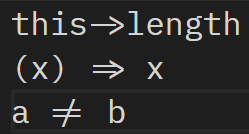

# Ligature Patcher for IBM Plex Mono

[IBM Plex](https://github.com/IBM/plex) Mono is a monospaced font family made by IBM, which is not only suitable for web display but also for code editor. By the convenience of OpenType, more and more programming font (for example [Fira Code](https://github.com/tonsky/FiraCode), [Pragmata Pro](https://www.fsd.it/shop/fonts/pragmatapro/) and [Iosevka](https://be5invis.github.io/Iosevka/)) choose add compound ligature glyphs for better experience and intuitive expression. This project is intended to do so on IBM Plex Mono.

## Preview

## Usage

**This project is still under development. Advice and PR are welcome!** :laughing:

1. Install [otfcc](https://github.com/caryll/otfcc), [Node.js](https://nodejs.org/en/) and NPM (or Yarn).
2. Clone (or download) [IBM Plex Mono](https://github.com/IBM/plex).
3. Clone this repo and install all dependencies by run `npm install` (or `yarn install`).
4. Run `node index.js -i IBM_PLEX_MONO_DIR` (`IBM_PLEX_MONO_DIR` is the folder where IBM Plex Mono font files locate).
5. You will find output font files in `build` folder (you can use `-o OUTPUT_FOLDER` to specify another output folder).

**P.S.** If otfcc is not in your `$PATH` (for example, you just simply download pre-built binaries of otfcc on Windows), you can use `-p OTFCC_FOLDER` to specify the folder where otfcc (two executable files: `otfccdump` and `otfccbuild`) locates.

## Changelog

* Dec 13, 2017: add support for `->`.
* Dec 15, 2017: add support for `=>` and `!=`.
* Dec 17, 2017: add alternate glyphs replacement for 'g' and '0'.

## LICENSE

The code in this project uses MIT license. Generated font files adopts the same license as IBM Plex Mono.

